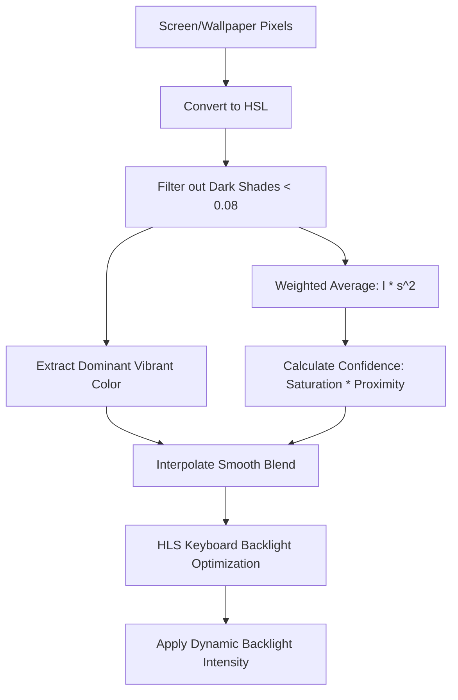

# Plasma Keyboard Backlight Sync & Video Ambience

A pair of high-performance, intelligent ambient lighting daemons for KDE Plasma on Linux (specifically optimized for ASUS TUF/ROG laptops using `asusctl` and `plasma-workspace`).

This project automatically syncs your keyboard backlight colors dynamically to match your current wallpaper or real-time screen content (Video Ambience) with advanced color analysis and smooth transitions.

---

## Features

### 🌌 1. Static Wallpaper Sync (`plasma-backlight-sync.py`)
- Background daemon that listens for active wallpaper changes via KDE D-Bus interface.
- Automatically reads and resizes images to perform high-speed, noise-free color extraction.
- Excludes dark shades and camera compression noise to ensure clean color tones.
- Applies **Lightness-weighted and Saturation-squared** average calculation to highlight vibrant elements (like nebulas).

### 🎬 2. Real-Time Video Ambience (`plasma-video-ambience.py`)
- On-demand PipeWire-based screen capturing using GStreamer and XDG Desktop Portal.
- **Adaptive Color Transition Engine:** Dynamically adjusts the transition speed (`alpha`) depending on the scale of color changes on screen:
  - *Calm scenes* result in a slow, cinematic transition (`alpha = 0.08`) with zero LED flickering.
  - *Radical changes* (flashes, explosions, scene cuts) scale up to near-instantaneous transitions (`alpha = 0.85`).
- **Brightness-Aware Auto-Dimming:** Automatically scales the target backlight lightness based on overall screen luminance (caps at `0.05` for soft glow in pitch black scenes and standard `0.45` for bright scenes).

### 🛡️ 3. Premium Color Blending Guard (Desaturation Guard)
- Bypasses neutral, cancelled-out average colors (e.g. orange and blue mixing to create muddy gray-pink).
- Calculates a continuous **confidence factor** based on average saturation and scene proximity.
- Dynamically blends the weighted average with the dominant vibrant color to prevent sudden color jumps, providing a butter-smooth morphing experience.

---

## Installation & Setup

### Requirements
Ensure you have the required dependencies installed:
```bash
# Arch Linux
sudo pacman -S python-gobject python-dbus gst-plugin-pipewire asusctl
```

### Installation
1. Move the scripts to your local bin:
   ```bash
   cp plasma-backlight-sync.py plasma-video-ambience.py ~/.local/bin/
   chmod +x ~/.local/bin/plasma-backlight-sync.py ~/.local/bin/plasma-video-ambience.py
   ```
2. Enable and start the wallpaper sync daemon systemd user service:
   ```bash
   mkdir -p ~/.config/systemd/user/
   cp plasma-backlight-sync.service ~/.config/systemd/user/
   systemctl --user daemon-reload
   systemctl --user enable --now plasma-backlight-sync.service
   ```

### Running Video Ambience
Simply run the script to stream your screen to the keyboard. It will automatically stop the wallpaper service to avoid conflicts and restart it when you exit:
```bash
~/.local/bin/plasma-video-ambience.py
```

---

## Color Analysis Engine

Both services share a state-of-the-art color analysis pipeline:



---

## Repository History

This repository tracks the full transition from the initial basic color extraction models to this optimized, adaptive ambient system.
